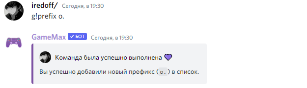
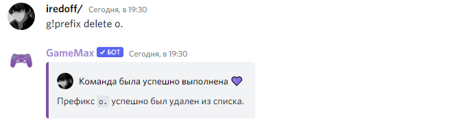
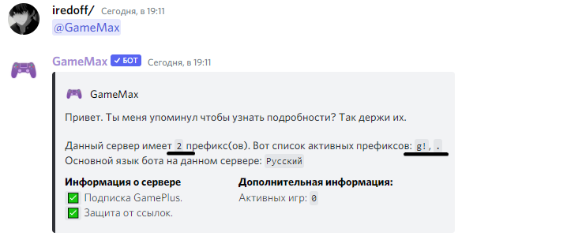

# 🔹 Работа с префиксами.

##  Как сменить префикс в боте?

* На самом деле все очень просто. Использовав команду - `g!help prefix`, вы сразу можете разобраться с этим. Но, все таки я покажу и объясню вам еще разок.

Использовав команду - `g!prefix <ваш префикс>`, вы добавите префикс. Список префиксов вы можете посмотреть упомянув бота.

## Как удалить установленный префикс?

* Для того чтобы _удалить установленный_ префикс, мы все так же используем команду -`g!prefix`  Благодаря аргументу `"delete"`, мы указываем префикс который мы хотим удалить.


Если у вас возникли ошибки при попытки удалить префикс то, либо он у вас не установлен, либо вы пытаетесь удалить стандартный префикс `- (g!)`


## Как посмотреть установленные префиксы?

* Для того чтобы получить список установленных префиксов, необходимо упомянуть бота.


В данный момент наш бот не поддерживает _**slash**_ команды. 


