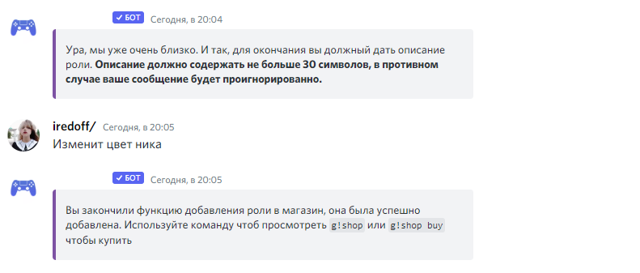
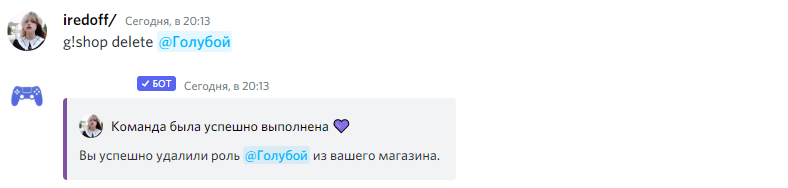
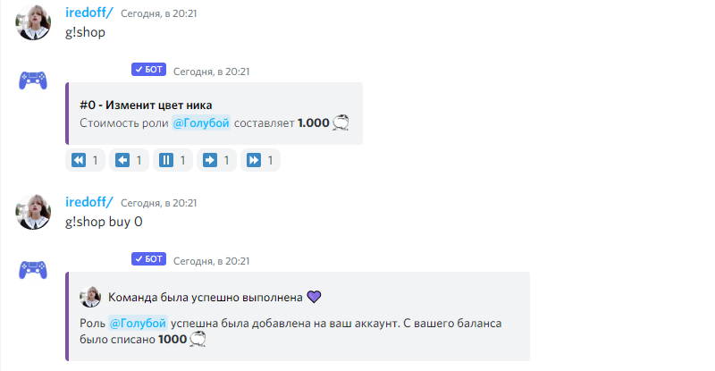
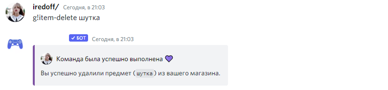
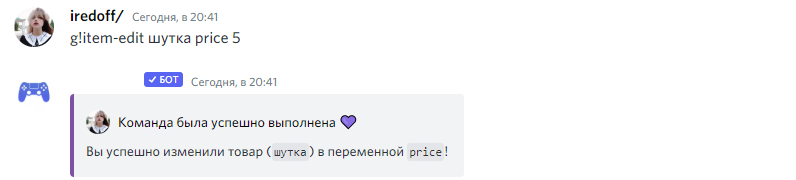

# 🛒 Создание и настройка магазина

### Виды магазинов.

Наш бот содержит в себе два вида магазина:

1. Магазин ролей.
2. Магазин предметов.

Мы расскажем подробнее об каждом виде магазина.

## 1️⃣ Магазин ролей.

Главная команда — **g!shop.** Данная команда работает только с аргументами, других команд для магазина ролей - нет.

Если мы просто напишем **g!shop** - получим список имеющих ролей в магазине. Но если вы не добавляли ролей в магазин, он будет пустым. Давайте исправим это.

#### Добавление ролей в магазин.

Чтобы добавить роль в магазин, используем главную команду и аргумент — **add.** В итоге полноценная команда должна выглядеть так: **g!shop add.** Дальше начнется процесс создания нового слота для роли. Все что нужно делать - это указывать нужные аргументы которые попросит вас бот. См ниже.


 Если во время процедуры бот не отвечает вам, значит вы даете этому пункту не правильные аргументы. \(Например превышение лимита допустимых символов, отрицательная сумма роли и тд.\)


#### Удаления добавленной роли из магазина.

Чтобы удалить добавленную роль из магазина, мы используем аргумент — _**delete**_. Так же после аргумента указываем роль которую хотим удалить. См ниже.

#### Покупка добавленных ролей.

Мы научились добавлять и удалять роли из магазина ролей, теперь давайте купим одну из добавленный ролей. Для этого существует аргумент — **buy.**

Все очень просто, после нашего аргумента указываем порядковый номер под которым находится роль. См ниже.

## 2️⃣ Магазин предметов.

Главная команда — **g!items / g!store.** А также **** — **g!inventory**  Тут уже немного посложнее. К данной категории магазина относятся дополнительные команды для взаимодействии:  `item-add`, `item-delete`, `item-edit`, `item-info`, `item-buy`, `item-use.` Давайте пройдемся по каждой команде отдельно.

#### item-add — Добавить предмет.

Система такая же как и с ролями, используете команду \(`g!item-add`\) и дальше просто указываете то что просит у вас бот. \(поэтапно.\)

#### item-delete - Удалить предмет.

Команда + название предмета, для удаления из магазина \(`g!item-delete [название]`\). См. ниже.

#### item-edit - Изменить параметр предмета.

Здесь ничего сложного, команда + название вашего предмета. \(`g!item-edit [название]`\). После бот отправит вам список параметров которые вы можете изменить.

Указываете необходимый вам аргумент и его **новое** значение. См ниже.

#### item-info - Посмотреть текущие настройки предмета.

Все просто, команда + название предмета \(`g!item-info [название]`\). Вы получите полные значения всех параметров.

#### item-buy - Покупка предмета.

Здесь тоже самое, никаких сложностей не должно возникнуть. команда + название предмета \(`g!item-buy [название]`\)

#### item-use / use - Использовать предмет.

Чтобы использовать предмет вы должны сначала приобрести его, он должен быть у вас в инвентаре \(`g!inventory`\). Стоить отметить что предмет может быть скрыт, и его не будет видно в инвентаре после покупки, но по факту он там будет. 

Используем предмет: `g!item-use [название]`

**У вас может возникнуть вопрос, для чего предмет нужно использовать?**

* Все просто, после использования, вы можете получить какую-либо роль \(если ее указал администратор при создании товара\), можете получить преимущество в дуэлях, ну или же просто для RP.

